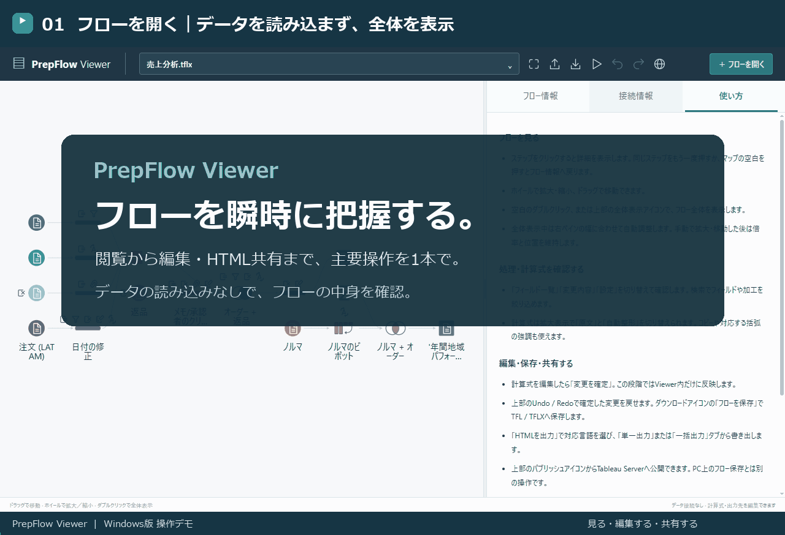

# PrepFlow Viewer

[](docs/media/readme-demo.gif)

**フローを瞬時に把握する。**

Tableau Prepのフローをデータの読み込みなしで即座に開き、中身を確認できるWindows用ツールです。見るだけなら、Tableau Prepのインストールは不要です。

`.tfl` / `.tflx` の閲覧、計算式・出力先の編集、閲覧用HTMLの単一・一括出力に対応。フローの実行やTableau Serverへの公開もできます。表示言語は日本語・英語・フランス語・スペイン語・ドイツ語・ポルトガル語（ブラジル）の6言語です。

## ダウンロード・起動

**Windows版の配布ZIPは準備中です。公開先：[GitHub Releases](https://github.com/dirsense/PrepFlowViewer/releases)**

配布ZIPを入手したら、次の手順で起動します。

1. ZIPを右クリックし、「すべて展開」します。
2. 展開したフォルダーの `PrepFlowViewer_v1.0.exe` を開きます。`_internal` フォルダーはEXEと同じ場所に置いてください。

Windows 10 / 11（64ビット）とMicrosoft Edge WebView2が必要です。Pythonのインストールは不要です。フローの実行には、有効なライセンスで動作するTableau Prep Builderが必要です。

## 使い方

**[図解付きの操作ガイドを開く](https://dirsense.github.io/PrepFlowViewer/manual.html)**

フローの閲覧・編集・保存・HTML出力・実行・公開の手順はこちらをご覧ください。配布ZIPにも同じ内容の `操作ガイド.html` を同梱します。

## 補足：開発者向け

<details>
<summary>リポジトリの構成・開発・ビルド方法</summary>

### 構成

| ファイル・フォルダー | 役割 |
| --- | --- |
| `prepflow.py` | フロー解析・保存・HTML生成・ローカルサーバー |
| `desktop_launcher.py` | Windows版の起動・専用ウィンドウ |
| `flow_runner.py` / `tableau_publish.py` | Prep CLI実行 / Server公開 |
| `output_edit.py` / `formula_types.py` | 出力先編集 / 計算式の型推定 |
| `web/` | 画面・スタイル・翻訳（読み込み順は `assets.json`） |
| `tests/` / `samples/` | 自動テスト / サンプルフロー |
| `manual.html` / `docs/media/` | 操作ガイドの原本 / READMEのデモ素材 |
| `build_windows.py` | Windows版のビルド・配布ZIP作成 |

画面コードの改修については [開発ガイド](web/README.md) を参照してください。

### ソースから起動・テスト

Python 3.10以降を使用します。Node.js 22以降は画面コードの整形・テスト用です。

```powershell
python -m pip install tableauserverclient==0.41
python prepflow.py --serve
```

```powershell
python -m unittest discover -s tests -v
npm ci
npm test
npm run format:check
```

### Windows版をビルド

Windows上の64ビット版Pythonを使用します（配布版はPython 3.13で確認）。

```powershell
python -m pip install --target .build-tools pyinstaller==6.22.3 pywebview==6.2.1 tableauserverclient==0.41
python build_windows.py
```

`dist/PrepFlowViewer/` にアプリと操作ガイド、`dist/PrepFlowViewer-v1.0-Windows-x64.zip` に配布ZIPを生成します。バージョンは `build_windows.py` の `VERSION` で管理します。

操作ガイドの公開版は `manual.html` を原本とし、mainへの更新時にGitHub Pagesへ自動反映します。

</details>
